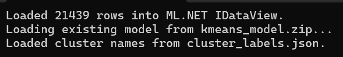
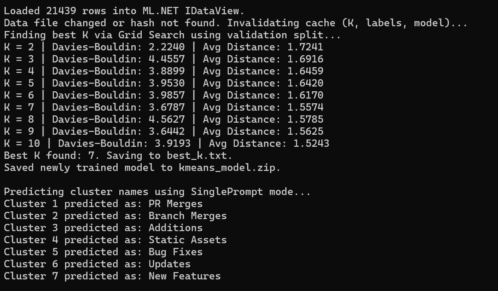
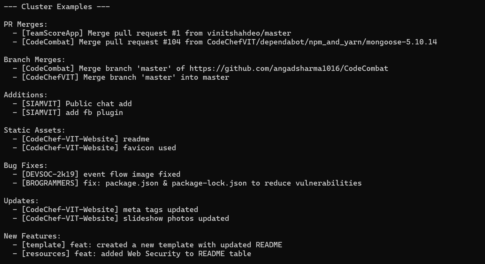
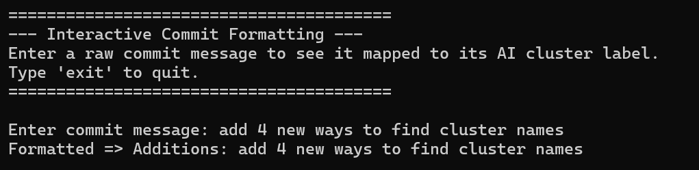

# Git Commit Categorize & ML.NET Analyser

A way to predict commit category using custom organisation data. Instead of thinking whether to type feat: spam or fix: spam, let AI/ML predict it for you!

An intelligent, console-based application built with **.NET 9** that automatically fetches GitHub commit messages, categorizes them using **ML.NET** (K-Means Clustering), and intelligently labels those categories in plain English using the **Google Gemini API**. Finally, it provides an interactive tool to format new commit messages based on the trained model.

## ? Features
- **GitHub Integration:** Fetches commits from repos in a target GitHub Organization.
- **Data Caching & Hashing:** Efficiently caches your datasets and only invalidates / re-trains when new data arrives.
- **ML.NET K-Means Clustering:** Learns from your commit history and automatically searches for the optimal $K$ value (number of clusters) using Grid Search and the Davies-Bouldin index.
- **Gemini AI Labeling:** Employs the `gemini-2.5-flash` model to analyze representative commits from each cluster and dynamically assigns highly accurate, human-readable labels (e.g., "UI Refactoring", "Bug Fixes").
- **Interactive Formatting:** Drop into an interactive command-line session to type new commit messages and instantly see them cleanly formatted as `Label: {commit}`.

## ?? Prerequisites
1. [.NET 9 SDK](https://dotnet.microsoft.com/download/dotnet/9.0)
2. A **GitHub Personal Access Token** (to fetch commits securely)
3. A **Google Gemini API Key** (for cluster labeling inference)

## ?? Setup & Installation

1. **Clone the repository:**
   ```bash
   git clone https://github.com/abhitrueprogrammer/git-commit-categorize.git
   cd git-commit-categorize
   ```

2. **Setup your Environment Variables:**
   Create a `.env` file in your root workspace containing the following:
   ```env
   GITHUB_TOKEN=your_github_personal_access_token_here
   GEMINI_API_KEY=your_google_gemini_api_key_here
   ```

3. **Restore Packages & Build:**
   ```bash
   cd ConsoleApp2
   dotnet restore
   dotnet build
   ```

## ?? Usage

Run the project directly via the .NET CLI:
```bash
dotnet run
```

### What happens during runtime?
1. The app will pull and cache your JSON dataset.
2. If the data is new or uncached, ML.NET prepares the data (80/20 train validation split) and extracts text features. Otherwise, it efficiently reloads the cached model!


3. A Grid Search evaluates clusters $K=2$ through $10$, identifies the best clustering structure, and saves the trained ML model globally (`kmeans_model.zip`).


4. The Gemini LLM will connect and predict human-readable category names.


5. You will enter the **Interactive Labeler**:

```text
========================================
--- Interactive Commit Formatting ---
Enter a raw commit message to see it mapped to its AI cluster label.
Type 'exit' to quit.
========================================

Enter commit message: fix padding on the login button
Formatted => UI Bug Fixes: fix padding on the login button
```



## ?? Architecture Overview
- `Program.cs`: Orchestrates data loading, caching/hashing checks, training, and triggers interactive modes.
- `CommitFetcher.cs`: Handles standard Octokit GitHub authentications and downloading.
- `Analyser.cs`: Contains the heavy ML.NET workflow (Splitting, Featurizing text, Grid Search K-Values).
- `AiClusterLabeler.cs`: Directly handles Gemini API requests and labeling dictionary cache management.
- `CommitInteractiveLabeler.cs`: Manages dynamic, real-time prediction and output formatting.